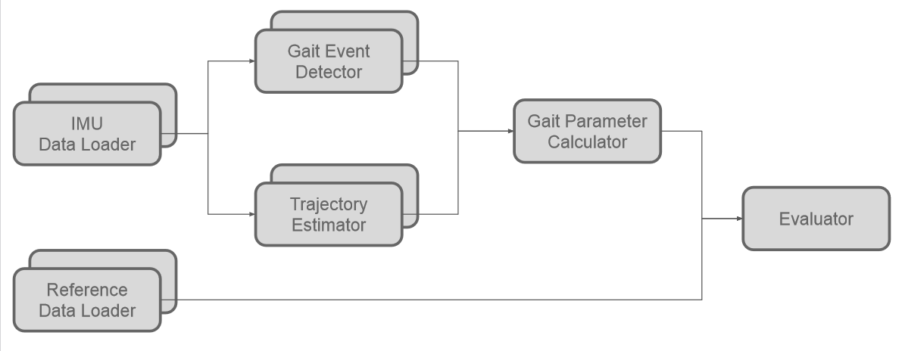
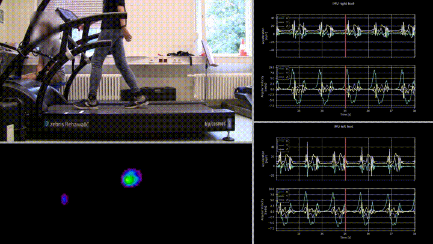
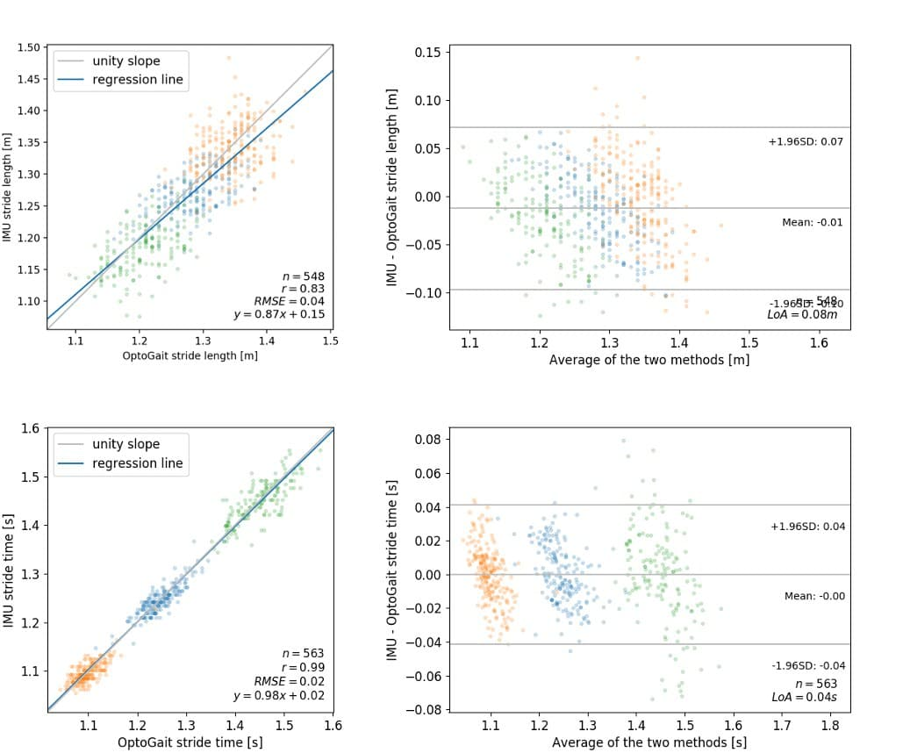

# TRIPOD: The <span style="color:SteelBlue">Tr</span>eadmill walking <br><span style="color:SteelBlue">I</span>MU, <span style="color:SteelBlue">P</span>edobarographic and Ph<span style="color:SteelBlue">o</span>toelectric <br><span style="color:SteelBlue">D</span>ataset and Data Processing Pipeline

## About

This repository contains a gait analysis data pipeline that can be used to:
 * load data from GaitUp Physilog IMUs 
 * load data from OptoGait
 * load data from Zebris FDM-T
 * estimate gait parameters from the IMU data
 * compare gait parameter of diferent measurement systems
 
The pipelines components for data loading and gait parameter estimation can be
exchanged in order to benchmark different recording systems and algorithms.

The pipeline consists of the following building blocks:



Further information can be found soon in a paper and the [documentation](https://hpi-ch.github.io/TRIPOD).

## Setup

Clone repository \
```git clone https://github.com/HPI-CH/TRIPOD.git``` \
```cd TRIPOD```

Create virtual environment with Python version 3.7 (for example using Conda) \
```conda create --name name_of_your_choice python=3.7``` \
```conda activate name_of_your_choice```

Install requirements \
```pip install -r requirements.txt```

Request data for scientific purposes [here](https://hpi-ch.github.io/TRIPOD/_static/data_request_form.html).

Save data to ```./data/raw/```



## Usage

Set configuration in ```./src/pipeline_playground.py``` as needed.

Run ```python ./src/pipeline_playground.py```

This runs the stages of the pipeline for the configured subjects, trials and reference system.

With the default configuration and the sample data provided in the repository, correlation plots and Bland-Altmann plots for three trials of one subject will be created, comparing stride length and stride time between OptoGait and the IMU system.




## Contributors

* Justin Trautmann
* Lin Zhou

The IMU gait analysis algorithms were adapted from [Tunca et al.](https://doi.org/10.3390/s17040825) who shared their MATLAB code with us.
